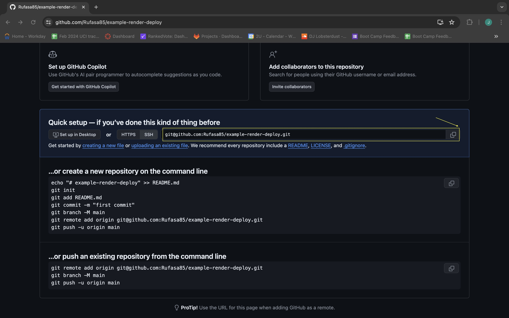
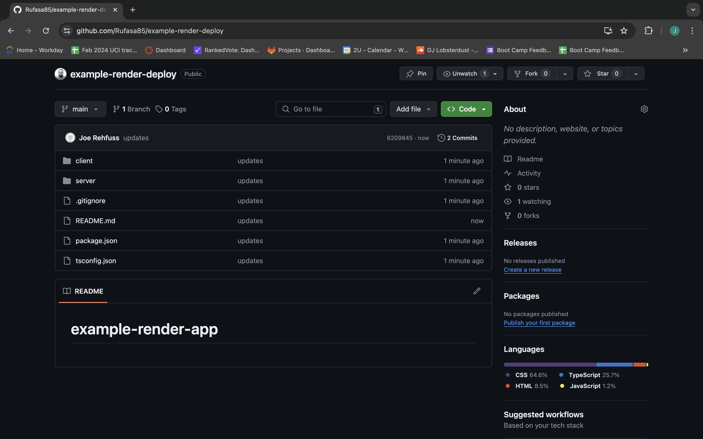

# Deploying with Render

* Up until now, we've been using GitHub pages to host our applications. However, now that we've added a server, we need a different solution, since GitHub pages only allow for static pages to be deployed. Render is a free, user-friendly deployment platform we can use. 

* In this activity, we'll take the provided `example-render-app` and deploy it to Render.

## Preparing the Repository

* Render allows us to deploy apps directly from a GitHub repo. Typically, we'll connect our projects to our GitHub accounts before we start working on them. Since we've provided the app here, we need to connect it to a GitHub repository.

* Create a new repository on GitHub. Make sure to leave the "Add a README" box unchecked. We want to create an entirely empty repo, like the following image: 


* To prevent conflicts with the class git repo, copy the `example-render-app` to a different location outside of the class repo, then navigate to that file in your terminal.

* In the terminal within the `example-render-app` folder, run the following commands:

```sh
git init
git remote add origin <REPOSITORY_URL>
```

* We can find the correct repository URL on the default GitHub repo page, directly under the "Quick setup&mdash;if you’ve done this kind of thing before" header, as highlighted in the following image:



* Add, commit, and push your files. You should now have an independent copy of the example repo, as shown in the following image: 



## Deploying to Render

Follow along with this [blog post](https://coding-boot-camp.github.io/full-stack/render/render-deployment-guide) to connect your Render account to your Github account, with the following changes:

* For the "Build Command", use the `npm run render-build` script.

* For the "Start Command", use `npm run start`. 

## Review

* Nice job! You should now be able to navigate to your first deployed Render application! Render allows us to deploy full-stack applications for free, so this is an invaluable tool to add to your skill set!

---

© 2024 edX Boot Camps LLC. Confidential and Proprietary. All Rights Reserved.
